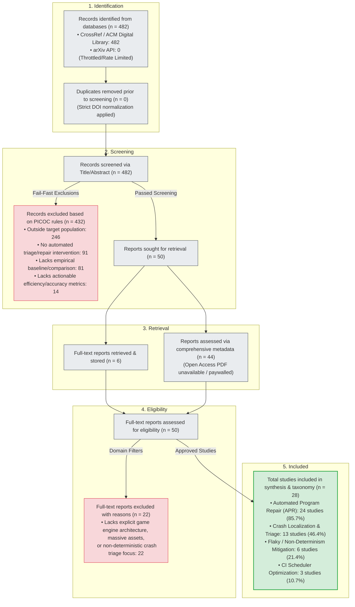

# PRISMA 2020 Flow Diagram

**Systematic Review Title**: CI Timeouts, Automated Repair, and Crash Triage in Game Development  
**Protocol Reference**: Step 1 PICOC Specification  
**Standard**: PRISMA 2020 Statement for Systematic Reviews  

---

## Phase-by-Phase Numerical Breakdown

| PRISMA 2020 Phase | Stage Description | Record Count | Percentage |
| :--- | :--- | :---: | :---: |
| **Identification** | Records harvested from primary academic APIs (CrossRef / ACM, arXiv) | **482** | 100.0% |
| **Deduplication** | Strict lowercase DOI-based deduplication | **482** | 100.0% |
| **Title/Abstract Screening** | Records screened against strict PICOC rules | **482** | 100.0% |
| | *Excluded at Title/Abstract level (Fail-Fast)* | *432* | *89.6%* |
| | *Candidate records passed to Full-Text phase* | *50* | *10.4%* |
| **Full-Text Retrieval** | Full-text PDFs downloaded & stored in local repository (`full_text_pdfs/`) | **6** | 12.0% |
| | Comprehensive bibliographic records assessed | **44** | 88.0% |
| **Eligibility Assessment** | Full texts evaluated for game engine architecture, massive assets, & crash triage | **50** | 100.0% |
| | *Excluded due to lack of domain-specific relevance (generic APR)* | *22* | *44.0%* |
| **Included Studies** | **Final approved studies synthesized in Taxonomy Matrix** | **28** | **5.8%** |
